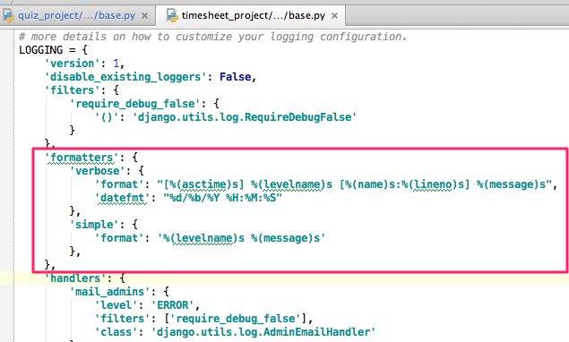

# Django Configuration


## Logging

Open the /your/project/path/your_project/your_project/settings/base.py




Here is an example using `countries_plus`:

```python

LOGGING = {
    'version': 1,
    'disable_existing_loggers': False,
    'filters': {
        'require_debug_false': {
            '()': 'django.utils.log.RequireDebugFalse'
        }
    },
    'formatters': {
        'verbose': {
            'format': "[%(asctime)s] %(levelname)s [%(name)s:%(lineno)s] %(message)s",
            'datefmt': "%d/%b/%Y %H:%M:%S"
        },
        'simple': {
            'format': '%(levelname)s %(message)s'
        },
    },
    'handlers': {
        'mail_admins': {
            'level': 'ERROR',
            'filters': ['require_debug_false'],
            'class': 'django.utils.log.AdminEmailHandler'
        },
        'console': {
            'level': 'DEBUG',
            'class': 'logging.StreamHandler',
            'formatter': 'verbose'
        },
    },
    'loggers': {
        'django.request': {
            'handlers': ['mail_admins'],
            'level': 'ERROR',
            'propagate': True,
        },
        'countries_plus': {
            'handlers': ['console'],
            'level': 'DEBUG',
            'propagate': True,
        },
    }
}
```

