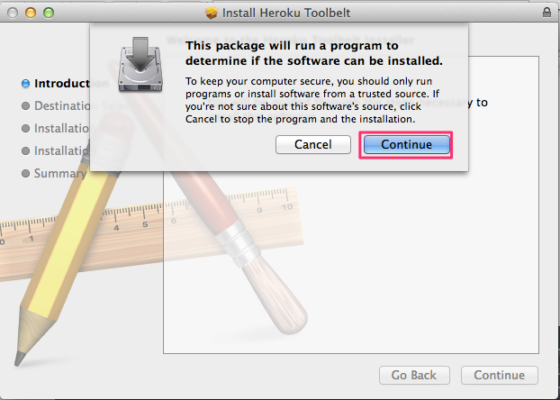
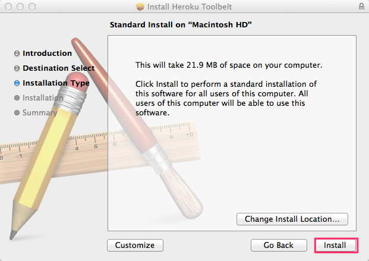
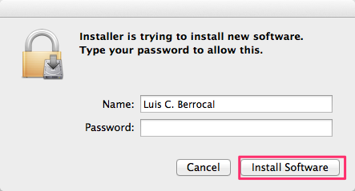
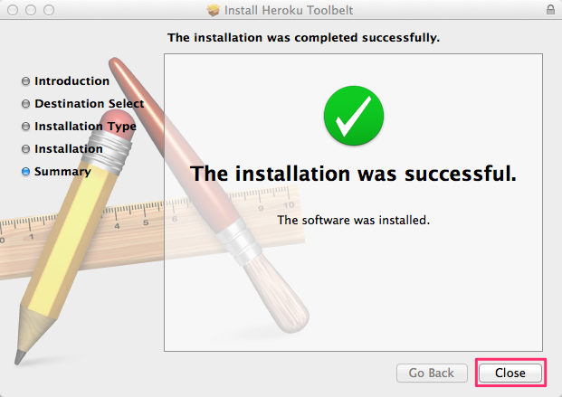
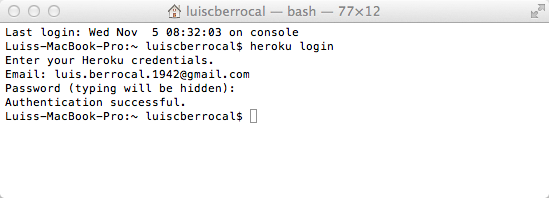
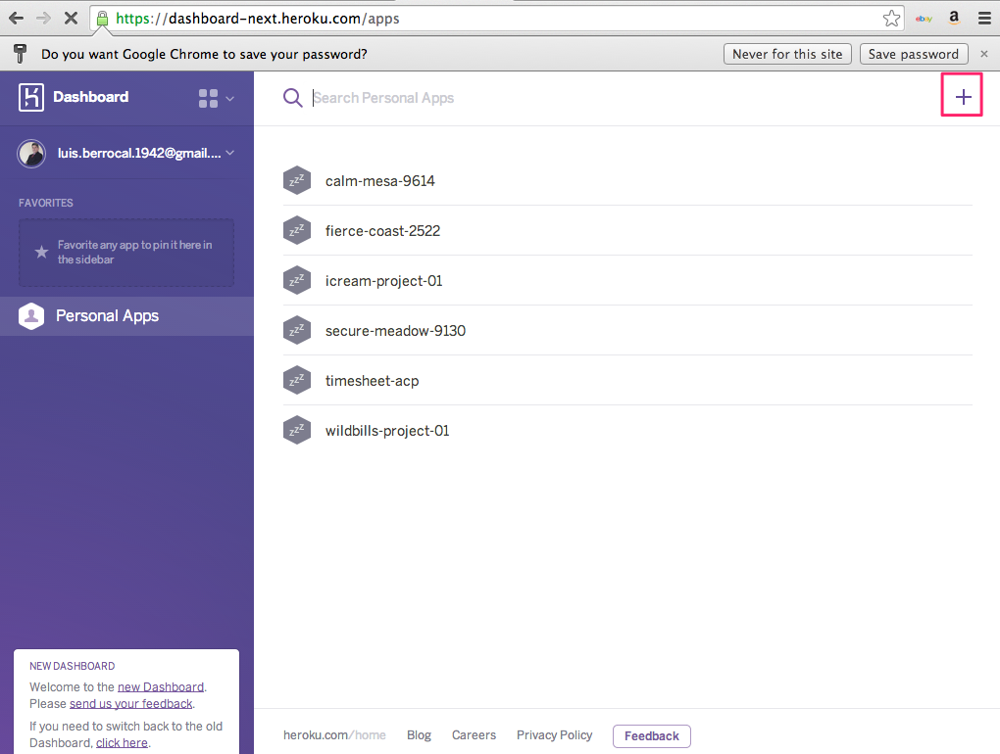
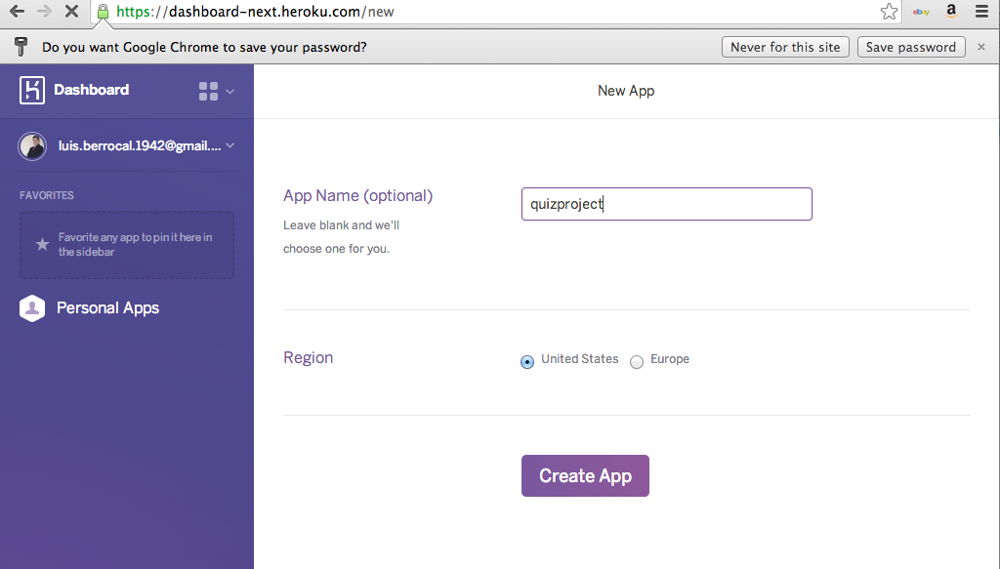
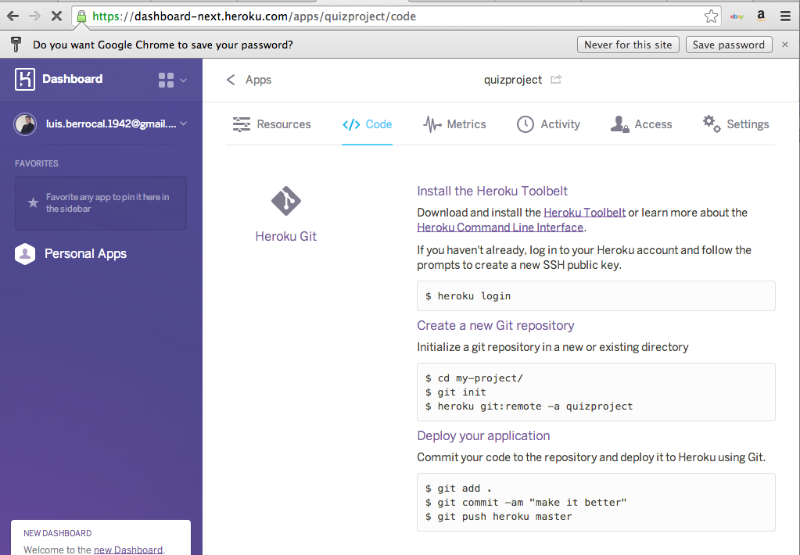
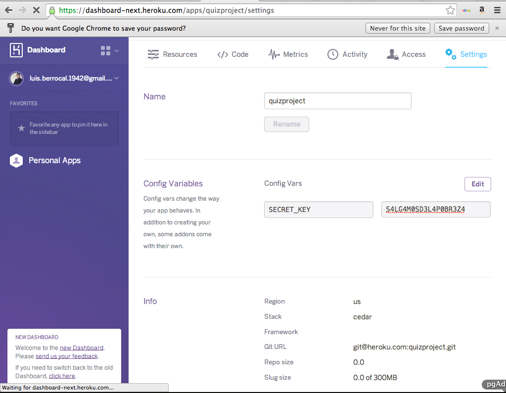

#Heroku

https://devcenter.heroku.com/articles/getting-started-with-django

##Installing the Heroku Toolbelt

https://toolbelt.heroku.com/











## Getting started with Heroku

Once installed, you'll have access to the heroku command from your command shell. Log in using the email address and password you used when creating your Heroku account:

$ heroku login
Enter your Heroku credentials.
Email: adam@example.com
Password:
Could not find an existing public key.
Would you like to generate one? [Yn]
Generating new SSH public key.
Uploading ssh public key /Users/adam/.ssh/id_rsa.pub

Since I already had ssh keys created and uploaded it didn’t ask me for SSH keys.



From your virtualenv:

```
$ pip install django-toolbelt 

Installing collected packages: Django, psycopg2, gunicorn, dj-database-url, dj-static, static   ... Successfully installed Django psycopg2 gunicorn dj-database-url dj-static static Cleaning up... 
```

##Runtime.txt

Verify your runtime contains the correct Python 3 version.

Mine reads:

```
python-3.4.1
```

##Procfile

Create the Procfile at /Users/luiscberrocal/PycharmProjects/wildbills_project/

```
web: gunicorn wildbills_project/wildbills_project.wsgi
```

##Django settings

Next, configure the application for the Heroku environment, includingHeroku’s Postgres database. The dj-database-url module will parse the value of the DATABASE_URL environment variable and convert them to something Django can understand.

### Changes to the settings.py

Make sure ‘dj-database-url’ is in your requirements file, then add the following to the bottom of your settings.py file:

```python
settings.py
# Parse database configuration from $DATABASE_URL 
import dj_database_url 
DATABASES['default'] =  dj_database_url.config()  
# Honor the 'X-Forwarded-Proto' header for request.is_secure() SECURE_PROXY_SSL_HEADER = ('HTTP_X_FORWARDED_PROTO', 'https')  
#Allow all host headers 
ALLOWED_HOSTS = ['*']  
# Static asset configuration 
import os 
BASE_DIR = os.path.dirname(os.path.abspath(__file__)) 
STATIC_ROOT = 'staticfiles' 
STATIC_URL = '/static/'  
STATICFILES_DIRS = (     os.path.join(BASE_DIR, 'static'), ) 
```

### Changes to the wsgi.py
With these settings available, you can add the following code to wsgi.py to serve static files in production:
```
wsgi.py
from django.core.wsgi import get_wsgi_application 
from dj_static import Cling  
```

###Changes on manage.py

```
if __name__ == "__main__":
    os.environ.setdefault("DJANGO_SETTINGS_MODULE", "timeclock_project.settings.production")

    from django.core.management import execute_from_command_line

    execute_from_command_line(sys.argv)
````

##Create  Site on Heroku

Login to Heroku











##Deploy to Heroku

Must be on .git root to run 

```
git push heroku master
````

##Configure Django on Heroku

```
$ heroku run python <project_name>/manage.py syncdb --settings=<project_name>.settings.production
````

For example for proyect quiz_project it would look like this:

```
$ heroku run python  quiz_project/manage.py migrate quiz_account --settings =quiz_project.settings.production
```


```
$ heroku apps:create <project_name> --buildpack=git://github.com/heroku/heroku-buildpack-python.git 

$ heroku addons:add memcachier:dev 
$ heroku addons:add sendgrid:starter 
$ heroku addons:add heroku-postgresql:dev 
$ heroku addons:add pgbackups:auto-month 
$ heroku addons:add newrelic:standard 
$ heroku config:add AWS_ACCESS_KEY_ID=<key id> 
$ heroku config:add AWS_SECRET_ACCESS_KEY=<secret key> 
$ heroku config:add AWS_STORAGE_BUCKET_NAME=<bucket name> setopt rcquotes 
```

```
$ git push heroku master
```

```
$ heroku ps:scale web=1
```
```
$ heroku run python <project_name>/manage.py syncdb --settings=<project_name>.settings.production 
$ heroku run python <project_name>/manage.py migrate --settings=<project_name>.settings.production 
$ heroku run python <project_name>/manage.py createsuperuser --settings=<project_name>.settings.production 
$ heroku run python <project_name>/manage.py collectstatic --settings=<project_name>.settings.production
```


http://test-heroku-lcb.herokuapp.com/ | git@heroku.com:test-heroku-lcb.git

heroku run python wildbills_project/manage.py collectstatic --settings=wildbills_project.settings.production

##Connecting pgAdmin to Heroku  Database


##Troubleshooting

heroku run python wildbills_project/manage.py shell --settings=wildbills_project.settings.production
