#Postgres

##Requirements

###Postgres.app

Download from http://postgresapp.com/ 

What's In The Box?
Postgres.app contains a full-featured PostgreSQL installation in a single package:

PostgreSQL 9.3.5
PostGIS 2.1.3
Procedural languages: PL/pgSQL, PL/Perl, PL/Python, and PLV8 (Javascript)
Popular extensions, including hstore and uuid-ossp, and more
A number of command-line utilities for managing PostgreSQL and working with GIS data

####Installing Postgres.app
To install Postgres.app, just drag it to your Applications folder and double click.

On first launch, Postgres will initialise a new database cluster and create a database for your username. A few moments after launching, you should be able to click on "Open psql" to connect to the database.

If you'd like to use the command line tools delivered with Postgres.app, see the section on Command Line Tools.


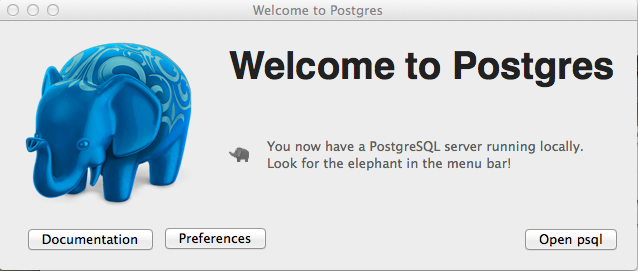

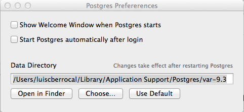


###PGAdmin3 1.18.1

It seems the postgress.app installation does not creat a postgress role by default. It created a username luiscberrocal. I could only connect to the database with that user.


Download from http://www.postgresql.org/ftp/pgadmin3/release/v1.18.1/osx/


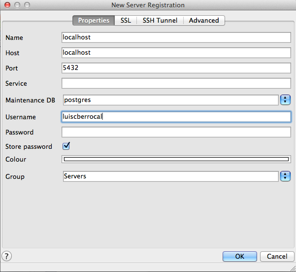

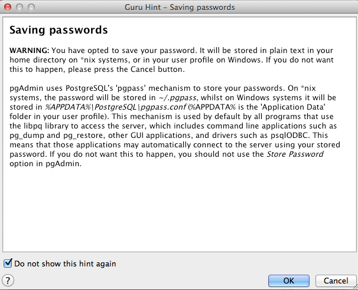


##Starting Postgres

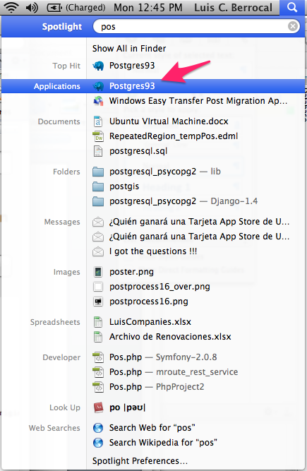

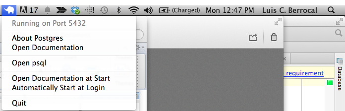


##Creating Database


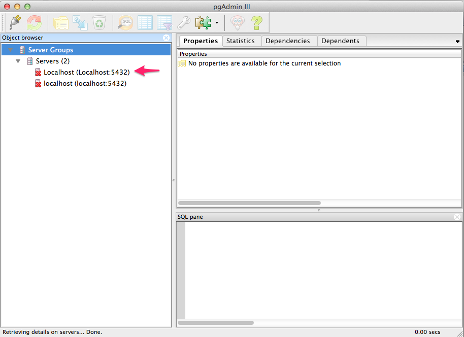

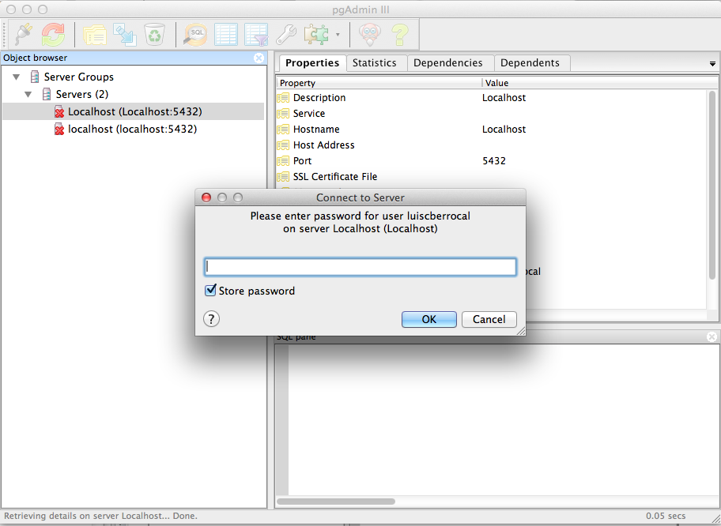


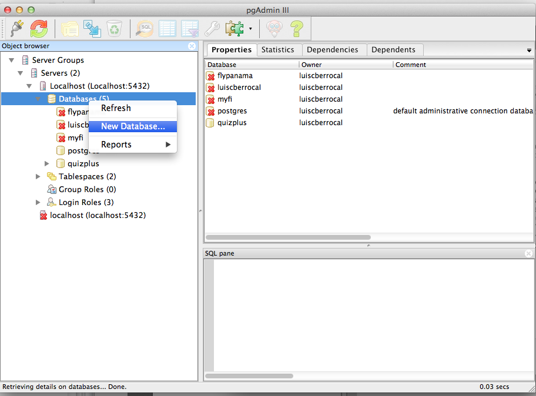


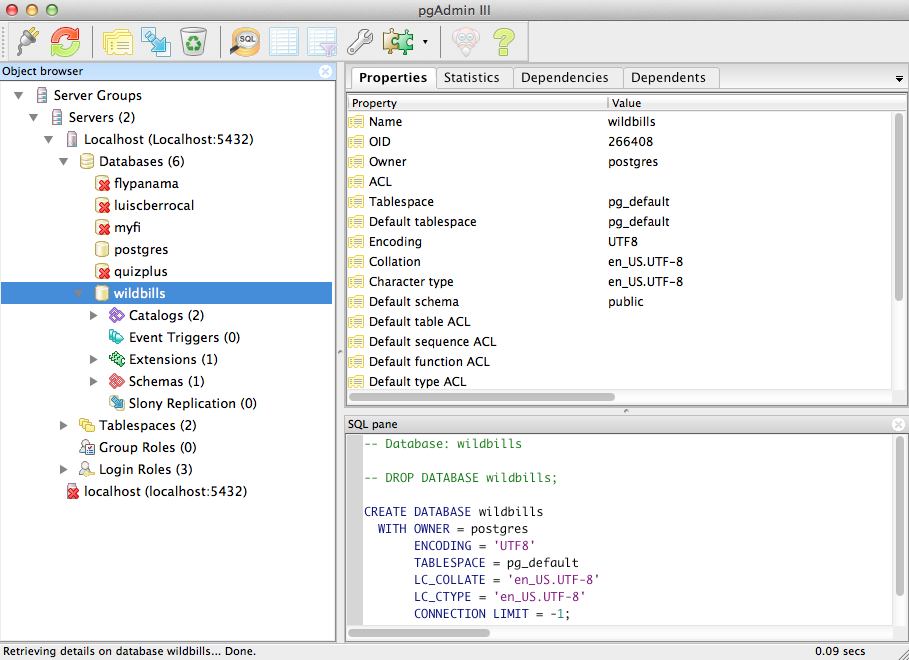


##Exporting the Postgres path

If you get an error Reading:

Error: pg_config executable not found.

You need to include in the PATH variable the postgres path
```
PATH=$PATH:/Applications/Postgres.app/Contents/Versions/9.3/bin/
```

##Connecting Django to Database

This should have been installed with the local requirements. So DO NOT run it. 

```
$ pip install psycopg2
```

Edit settings/local.py and replace database configuration for this:

```python

########## DATABASE CONFIGURATION
# See: https://docs.djangoproject.com/en/dev/ref/settings/#databases
DATABASES = {
    "default": {
        "ENGINE": "django.db.backends.postgresql_psycopg2",
        "NAME": "wildbills",
        "USER": "",
        "PASSWORD": "",
        "HOST": "localhost",
        "PORT": "",
    },
}
########## END DATABASE CONFIGURATION
```


##Run syncdb (Django 1.6 or less)

```
$ python manage.py syncdb --settings=timesheet_project.settings.local

```

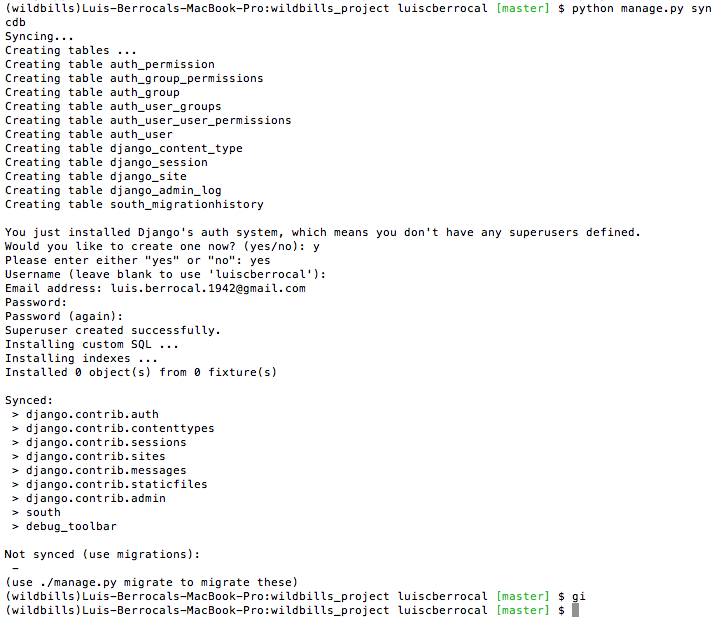

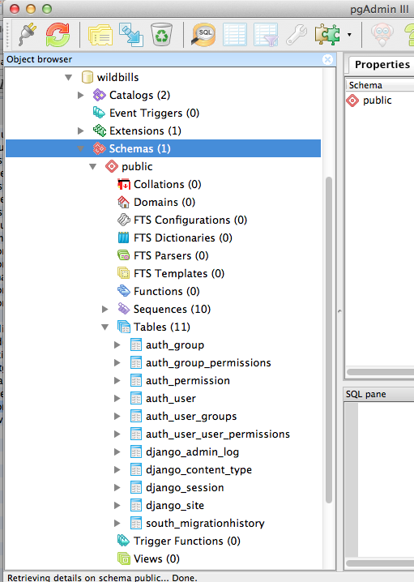


##Run syncdb (Django 1.7.x)

```
$ python manage.py syncdb --settings=timesheet_project.settings.local
```

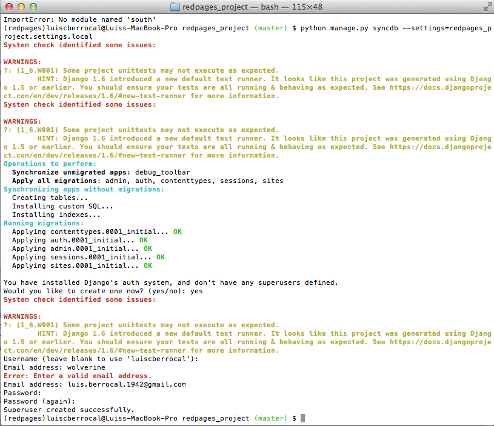

##Problem connecting to Postgres from Windows

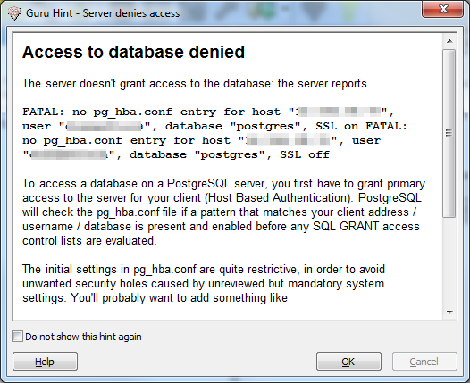

/etc/postgresql/9.1/main/pg_hba.conf

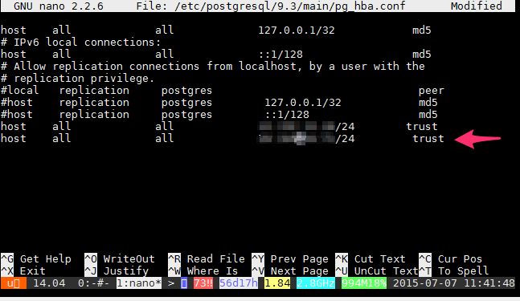

```
$ service postgresql restart
```

