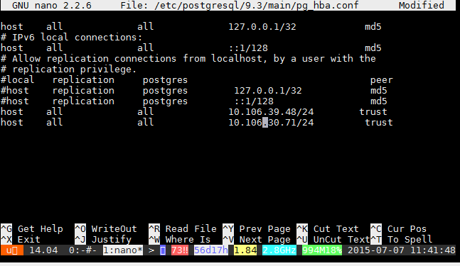

##Problem connecting to Postgres from Windows

I encountered this error when I tried to connect with pgAdmin running on Windows 7 to a Postgres instance running on an Ubuntu 14.04 LTS.


It seems my ip address was not cleared to connect to the server. I had to edit on the ubunte server the `/etc/postgresql/9.1/main/pg_hba.conf` file.

Run

```
$ sudo nano /etc/postgresql/9.1/main/pg_hba.conf
```

Add your ip address range.



```
$ service postgresql restart
```
