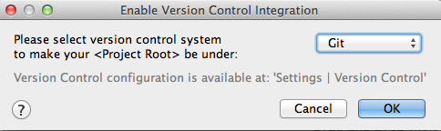

#Pycharm

##Open the Project
Open the folder where you created the Project.

##Configure Virtual Environment in PyCharm

Navigate to the python file on your virtual environment.

/Users/luiscberrocal/virtual_environments/wildbills/bin/python

##Enable Version Control

The following steps are to enable git as version control for your project.

##Configure Django Support

Configure Content Root

Configure Django Server

http://127.0.0.1:8555/

PyDev on Eclipse Luna

