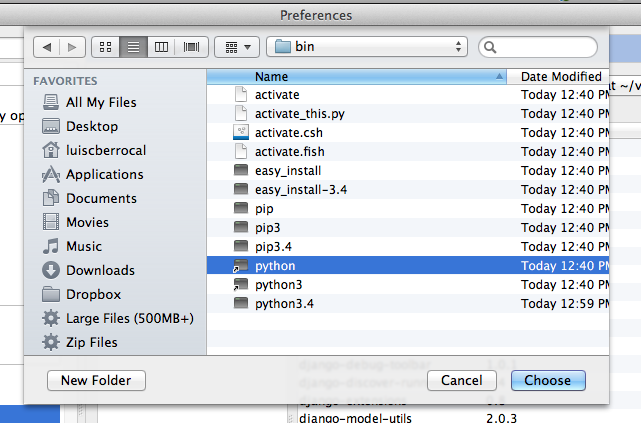

#Pycharm

##Open the Project
Open the folder where you created the Project.

##Configure Virtual Environment in PyCharm

Navigate to the python file on your virtual environment.

/Users/luiscberrocal/virtual_environments/wildbills/bin/python

##Enable Version Control

The following steps are to enable git as version control for your project.

##Configure Django Support

###Configure Content Root

###Configure Django Server

Now open http://127.0.0.1:8555/

