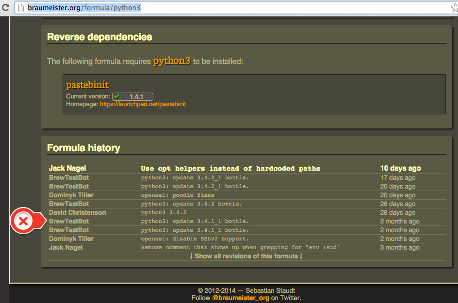
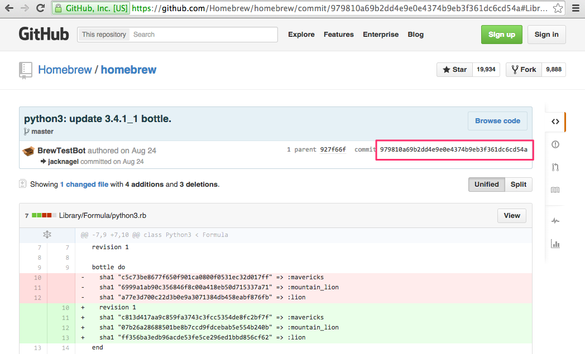
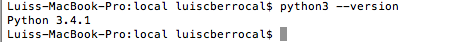

#Installing Python3

Since part of the workflow shown here is to deploy to Heroku we need to be sure we are using
a version of Python supported by Heroku. Always check [Supported Python Runtimes](https://devcenter.heroku.com/articles/python-runtimes#supported-python-runtimes)

http://blog.manbolo.com/2013/02/04/how-to-install-python-3-and-pydev-on-osx

http://hackercodex.com/guide/python-development-environment-on-mac-osx/

##Updating version 3.4.1 to 3.4.3

As of august 2015 Heroku supports 3.4.3 which is the latest version, So you don't have 
to follow the steps shown in [Installing version Python 3.4.1](#installing-version-python-3-4-1)

Since I cheated forcing home brew to  install an older Python3 formula. I had to do a hard reset to eliminate the python3.rb formula.

``````bash
$ cd $( brew --prefix )

$ git reset –hard

$ brew upgrade

$ brew install python3

``````


##Installing version Python 3.4.1

Current homebrew version installs Python 3.4.2 but Heroku currently supports python 3.4.1.
So we need to install 3.4.1. To do this  we need to install a specific commit

The commit we are looking for can be found at http://braumeister.org/formula/python3






You must unlink the current versión 3.4.2

``````
$ brew unlink python3
``````


First, go to the homebrew base directory
``````
$ cd $( brew --prefix )
``````

Checkout some old formula

```````
$ git checkout 979810a69b2dd4e9e0e4374b9eb3f361dc6cd54a Library/Formula/python3.rb
$ brew install python3
``````
 




