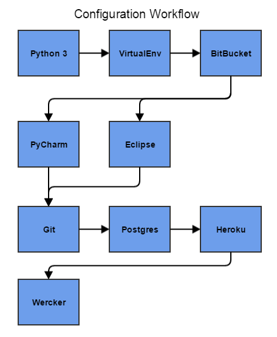

#Introduction

Most tutorials Django tutorials will start with the creation of the first app.

Configuring the environments can be sometimes cumbersome and confusing if you don't do this often enough.

The following diagram (built with [Gliffy](https://www.gliffy.com/)) shows the steps to follow in order to 
star a new Django project.

