#VirtualEnv

##Installing Python3

Since part of the workflow shown here is to deploy to Heroku we need to be sure we are using
a version of Python supported by Heroku. Always check [Supported Python Runtimes](https://devcenter.heroku.com/articles/python-runtimes#supported-python-runtimes)

http://blog.manbolo.com/2013/02/04/how-to-install-python-3-and-pydev-on-osx

http://hackercodex.com/guide/python-development-environment-on-mac-osx/

##Updating version 3.4.1 to 3.4.3

As of august 2015 Heroku supports 3.4.3 which is the latest version, So you don't have 
to follow the steps shown in [Installing version Python 3.4.1](installing-version-python-3-4-1)

Since I cheated forcing home brew to  install an older Python3 formula. I had to do a hard reset to eliminate the python3.rb formula.

``````bash
$ cd $( brew --prefix )

$ git reset –hard

$ brew upgrade

$ brew install python3

``````

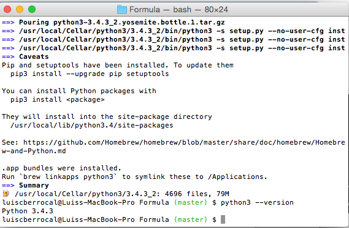


##Installing version Python 3.4.1

Current homebrew version installs Python 3.4.2 but Heroku currently supports python 3.4.1.
So we need to install 3.4.1. To do this  we need to install a specific commit

The commit we are looking for can be found at http://braumeister.org/formula/python3


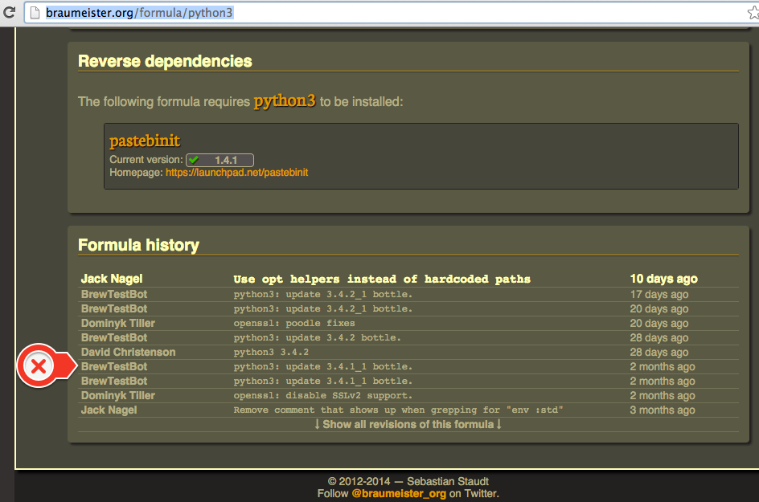

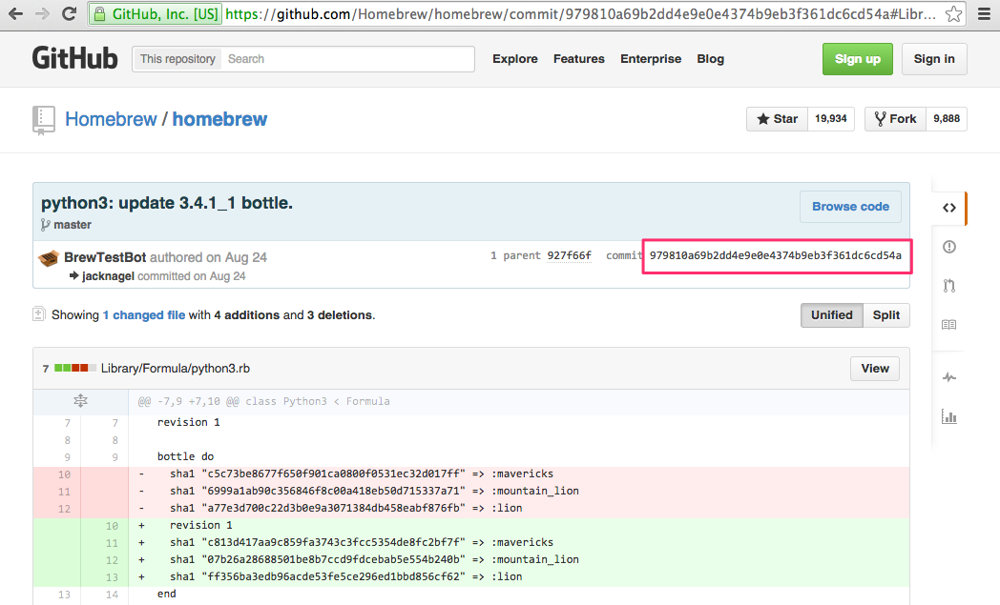

You must unlink the current versión 3.4.2

``````
$ brew unlink python3
``````

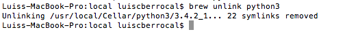


First, go to the homebrew base directory
``````
$ cd $( brew --prefix )
``````

Checkout some old formula
```````
$ git checkout 979810a69b2dd4e9e0e4374b9eb3f361dc6cd54a Library/Formula/python3.rb
$ brew install python3
``````
 
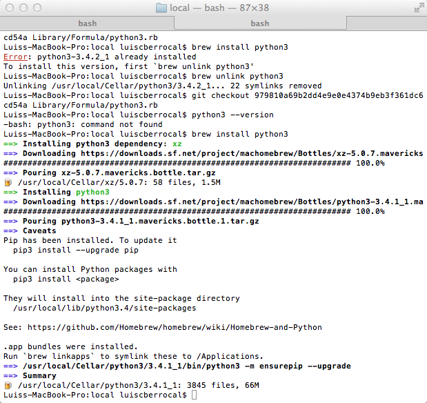


##Installing Virtualenv for Python3

``````
$ pip3 install virtualenv
``````

It gets installed /usr/local/lib/python3.4/site-packages/

##Creating a Virtual Environment on Windows 7

``````
$ cd c:\python_environments
$ c:\Python34\python.exe c:\Python34\Lib\site-packages\virtualenv.py --no-site-packages <virtual_environment_name>
``````
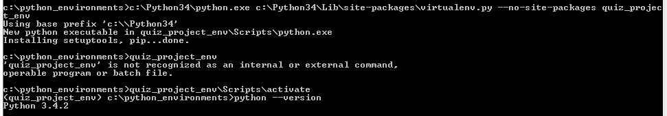

##Creating a Virtual Environment on OSx

My path for virtual environments is ~/virtual_environments.

Replace <virtual_environment_name> with the name of your virtual environment.

``````
$ cd ~/virtual_environments

$ python3 /usr/local/lib/python3.4/site-packages/virtualenv.py --no-site-packages <virtual_environment_name>
``````
 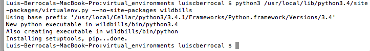

If you have installed Anaconda. You will get an error (see Problem with Anaconda and VirtualEnv  on page 11). Use this command instead
``````
$ /usr/local/Cellar/python3/3.4.1_1/bin/python3 /usr/local/lib/python3.4/site-packages/virtualenv.py --no-site-packages <virtual_environment_name>
``````
``````
cd ~/virtual_environments
source ./<virtual_environment_name>/bin/actívate
``````

``````
python --version
``````
 
 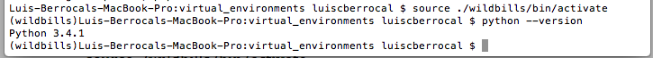
 
 
##Installing Django

To install Django in the new virtual environment, run the following command:

``````
$ pip install django 
``````

## Creating your Project

The proposed projec structure is based on the book Two Scoops of Icecream. The template is found here: https://github.com/twoscoops/django-twoscoops-project 
To create a new Django project called 'wildbills' using django-twoscoops-project, run the following command:
``````
$ cd ~/PycharmProjects
``````

I created a fork of the project with the two scoops template to add Heroku support.

This project has the Procfile, runtime.txt files that require Heroku. This project is configured for Python 3.4.1.
``````
$ django-admin.py startproject --template=https://github.com/luiscberrocal/django-twoscoops-project/archive/master.zip --extension=py,rst,html --name=Procfile wildbills_project
``````
The original I used was this one. Do not use this one, I’m showing it as reference to remember where I got the command from.

``````
$ django-admin.py startproject --template=https://github.com/twoscoops/django-twoscoops-project/archive/master.zip --extension=py,rst,html wildbills_project
``````

 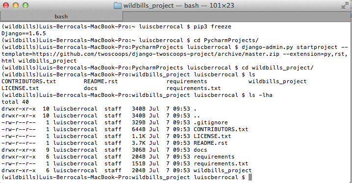
 
##Installation of Dependencies

Before you install the dependencies make sure you have exported the path of the postgre executable (seeExporting the Postgres path page  54)
Depending on where you are installing dependencies:
In development:
``````
$ cd ~/Pycharm_Projects/wildbills_project
$ pip install -r requirements/local.txt 
``````
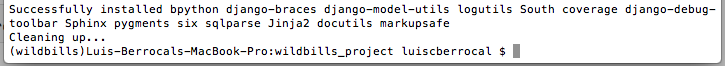

if you get an error while installing psycopg2 check Exporting the Postgres path (page 39)
Run pip freeze to check if everything installed 
``````
$ pip freeze
``````
It should look something like this:

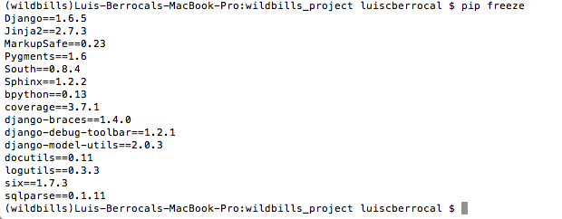


I used my fork for the two-scoops of icecream template it will also include the postegres packages and other 
packages required for Heroku. After a pip freeze it would look something more like this

``````
Django==1.6.5
Jinja2==2.7.3
MarkupSafe==0.23
Pygments==1.6
South==0.8.4
Sphinx==1.2.2
bpython==0.13
coverage==3.7.1
dj-database-url==0.3.0
dj-static==0.0.5
django-braces==1.4.0
django-debug-toolbar==1.2.1
django-model-utils==2.0.3
docutils==0.12
logutils==0.3.3
psycopg2==2.5.3
pystache==0.5.4
six==1.7.3
sqlparse==0.1.11
static==1.0.2
``````

For production:

``````
$ pip install -r requirements.txt
``````

note: We install production requirements this way because many Platforms as a Services expect a requirements.txt file in the root of projects.


###Problem with psycopg2 on Windows

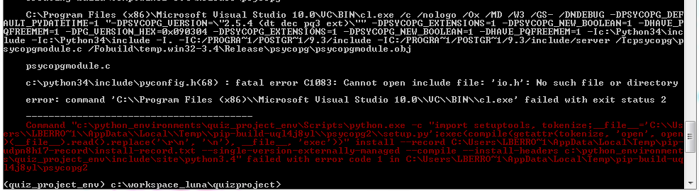


Download compiled driver

http://www.lfd.uci.edu/~gohlke/pythonlibs/#psycopg

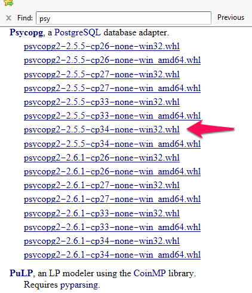

``````
$ pip install C:\Users\lberrocal\Downloads\psycopg2-2.5.5-cp34-none-win32.whl
``````

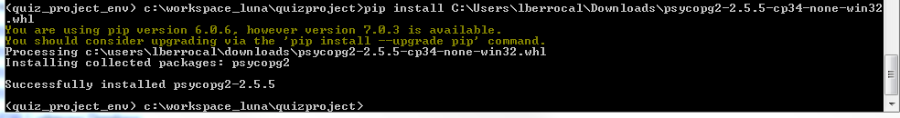


###Problem with Anaconda and VirtualEnv

I installed Anaconda on my mac and it changed the defaul pyhton3 executable.

When I try to create a virtualenv I get the following message:

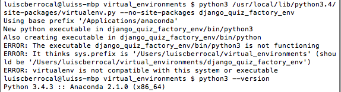

When I ran python --version I realized when installing Anaconda it changed my default python3.

Instead of using python3 use /usr/local/Cellar/python3/3.4.1_1/bin/python3

``````

$ /usr/local/Cellar/python3/3.4.1_1/bin/python3 /usr/local/lib/python3.4/site-packages/virtualenv.py --no-site-packages <virtual_environment_name>

``````

###Automating the VirtualEnv Environment

It is a boring process every time I start a new Project to  create the virtual environment and configure my Project the way I want it.

####Windows

This script is on a gist  https://gist.github.com/1da4dfd3f39c0e8563d7.git

``````
@echo off
SET VIRTUAL_ENVIRONMENT_FOLDER=C:\python_environments
SET PYCHARM_PROJECT_FOLDER=%USERPROFILE%\PyCharmProjects
SET PYTHON_PROJECT=%~1
SET PROJECT_ENVIRONMENT=%VIRTUAL_ENVIRONMENT_FOLDER%\%PYTHON_PROJECT%_env
cd %VIRTUAL_ENVIRONMENT_FOLDER%
REM echo %PYCHARM_PROJECT_FOLDER%
echo %PROJECT_ENVIRONMENT%
C:\Python34\python.exe C:\Python34\Lib\site-packages\virtualenv.py --no-site-packages %PROJECT_ENVIRONMENT%

call %PROJECT_ENVIRONMENT%\Scripts\activate.bat

%PROJECT_ENVIRONMENT%\Scripts\pip.exe install Django==1.7.9

cd %PYCHARM_PROJECT_FOLDER%

%PROJECT_ENVIRONMENT%\Scripts\django-admin.exe startproject --template=https://github.com/luiscberrocal/django-twoscoops-project/archive/master.zip --extension=py,rst,html --name=Procfile %PYTHON_PROJECT%

echo Created enviroment %PROJECT_ENVIRONMENT%
echo Created project %PYCHARM_PROJECT_FOLDER%\%PYTHON_PROJECT%
``````
 
 
``````
setup_django_project.bat <project_name>
``````


This will create a <project_name>_env environment folder and a <project_name>_project folder. It will also install django 1.7.9


####Mac

I created a smal bash script that will create the environment and the Project. The script is called setup_django_project.sh

This script is on a gist https://gist.github.com/525480de74d4a23d6670.git 

``````bash
#!/bin/bash -e

VIRTUAL_ENVIRONMENT_FOLDER=~/virtual_environments
PYCHARM_PROJECT_FOLDER=~/PycharmProjects/

cd $VIRTUAL_ENVIRONMENT_FOLDER;

/usr/local/Cellar/python3/3.4.1_1/bin/python3 /usr/local/lib/python3.4/site-packages/virtualenv.py --no-site-packages $1_env;

source $VIRTUAL_ENVIRONMENT_FOLDER/$1_env/bin/activate

pip install Django==1.7.9

cd $PYCHARM_PROJECT_FOLDER

django-admin.py startproject --template=https://github.com/luiscberrocal/django-twoscoops-project/archive/master.zip --extension=py,rst,html --name=Procfile $1_project

pip install psycopg2

echo 'Created environment '  $VIRTUAL_ENVIRONMENT_FOLDER/$1_env
echo 'Created project ' $PYCHARM_PROJECT_FOLDER/$1_project
``````

./setup_django_project.sh <project_name>

This will create a <project_name>_env environment folder and a <project_name>_project folder. It will also install django 1.7.9 and the latest postgres driver.


 


 
 


