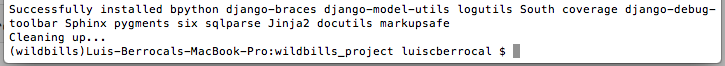
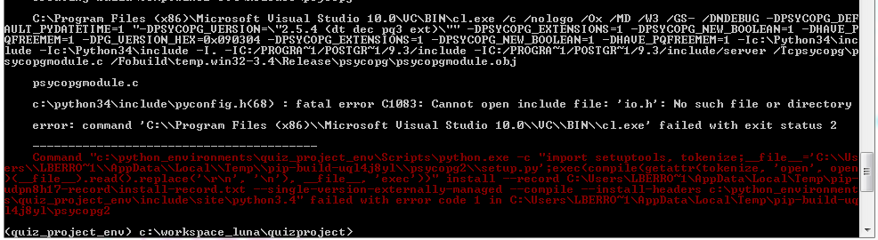
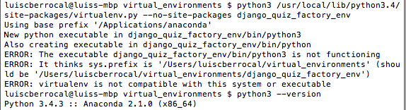

##Installation of Dependencies

Before you install the dependencies make sure you have exported the path of the postgres executable (this is for mac only).

###Exporting the Postgres path

If you get an error Reading:

Error: pg_config executable not found.

You need to include in the PATH variable the postgres path

```
 $ PATH=$PATH:/Applications/Postgres.app/Contents/Versions/9.3/bin/
````

###Installing Requirements

Depending on where you are installing dependencies:
In development:
``````
$ cd ~/Pycharm_Projects/wildbills_project
$ pip install -r requirements/local.txt 
``````


if you get an error while installing psycopg2 check Exporting the Postgres path (page 39)
Run pip freeze to check if everything installed 
``````
$ pip freeze
``````
It should look something like this:


I used my fork for the two-scoops of icecream template it will also include the postegres packages and other 
packages required for Heroku. After a pip freeze it would look something more like this

``````
Django==1.6.5
Jinja2==2.7.3
MarkupSafe==0.23
Pygments==1.6
South==0.8.4
Sphinx==1.2.2
bpython==0.13
coverage==3.7.1
dj-database-url==0.3.0
dj-static==0.0.5
django-braces==1.4.0
django-debug-toolbar==1.2.1
django-model-utils==2.0.3
docutils==0.12
logutils==0.3.3
psycopg2==2.5.3
pystache==0.5.4
six==1.7.3
sqlparse==0.1.11
static==1.0.2
``````

For production:

``````
$ pip install -r requirements.txt
``````

note: We install production requirements this way because many Platforms as a Services expect a requirements.txt file in the root of projects.


###Problem with psycopg2 on Windows




Download compiled driver

http://www.lfd.uci.edu/~gohlke/pythonlibs/#psycopg


``````
$ pip install C:\Users\lberrocal\Downloads\psycopg2-2.5.5-cp34-none-win32.whl
``````


###Problem with Anaconda and VirtualEnv

I installed Anaconda on my mac and it changed the defaul pyhton3 executable.

When I try to create a virtualenv I get the following message:



When I ran python --version I realized when installing Anaconda it changed my default python3.

Instead of using python3 use /usr/local/Cellar/python3/3.4.1_1/bin/python3

``````

$ /usr/local/Cellar/python3/3.4.1_1/bin/python3 /usr/local/lib/python3.4/site-packages/virtualenv.py --no-site-packages <virtual_environment_name>

``````

###Automating the VirtualEnv Environment

It is a boring process every time I start a new Project to  create the virtual environment and configure my Project the way I want it.

####Windows

This script is on a gist  https://gist.github.com/1da4dfd3f39c0e8563d7.git

``````
@echo off
SET VIRTUAL_ENVIRONMENT_FOLDER=C:\python_environments
SET PYCHARM_PROJECT_FOLDER=%USERPROFILE%\PyCharmProjects
SET PYTHON_PROJECT=%~1
SET PROJECT_ENVIRONMENT=%VIRTUAL_ENVIRONMENT_FOLDER%\%PYTHON_PROJECT%_env
cd %VIRTUAL_ENVIRONMENT_FOLDER%
REM echo %PYCHARM_PROJECT_FOLDER%
echo %PROJECT_ENVIRONMENT%
C:\Python34\python.exe C:\Python34\Lib\site-packages\virtualenv.py --no-site-packages %PROJECT_ENVIRONMENT%

call %PROJECT_ENVIRONMENT%\Scripts\activate.bat

%PROJECT_ENVIRONMENT%\Scripts\pip.exe install Django==1.7.9

cd %PYCHARM_PROJECT_FOLDER%

%PROJECT_ENVIRONMENT%\Scripts\django-admin.exe startproject --template=https://github.com/luiscberrocal/django-twoscoops-project/archive/master.zip --extension=py,rst,html --name=Procfile %PYTHON_PROJECT%

echo Created enviroment %PROJECT_ENVIRONMENT%
echo Created project %PYCHARM_PROJECT_FOLDER%\%PYTHON_PROJECT%
``````
 
 
``````
setup_django_project.bat <project_name>
``````


This will create a <project_name>_env environment folder and a <project_name>_project folder. It will also install django 1.7.9


####Mac

I created a smal bash script that will create the environment and the Project. The script is called setup_django_project.sh

This script is on a gist https://gist.github.com/525480de74d4a23d6670.git 

``````bash
#!/bin/bash -e

VIRTUAL_ENVIRONMENT_FOLDER=~/virtual_environments
PYCHARM_PROJECT_FOLDER=~/PycharmProjects/

cd $VIRTUAL_ENVIRONMENT_FOLDER;

/usr/local/Cellar/python3/3.4.1_1/bin/python3 /usr/local/lib/python3.4/site-packages/virtualenv.py --no-site-packages $1_env;

source $VIRTUAL_ENVIRONMENT_FOLDER/$1_env/bin/activate

pip install Django==1.7.9

cd $PYCHARM_PROJECT_FOLDER

django-admin.py startproject --template=https://github.com/luiscberrocal/django-twoscoops-project/archive/master.zip --extension=py,rst,html --name=Procfile $1_project

pip install psycopg2

echo 'Created environment '  $VIRTUAL_ENVIRONMENT_FOLDER/$1_env
echo 'Created project ' $PYCHARM_PROJECT_FOLDER/$1_project
``````

./setup_django_project.sh <project_name>

This will create a <project_name>_env environment folder and a <project_name>_project folder. It will also install django 1.7.9 and the latest postgres driver.


 


 
 


