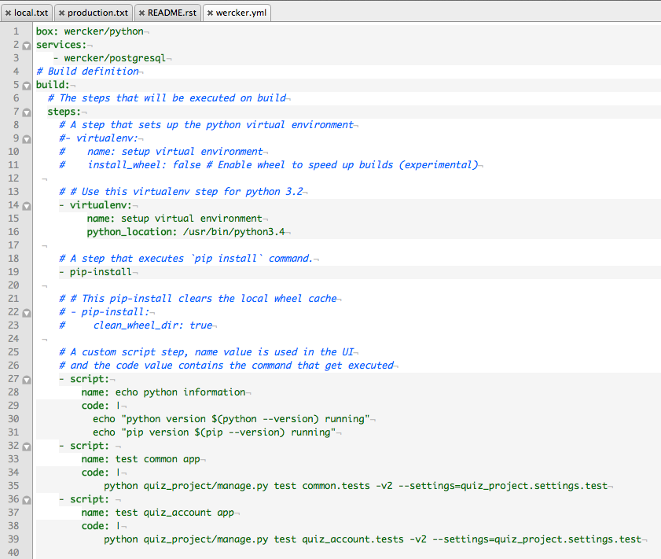
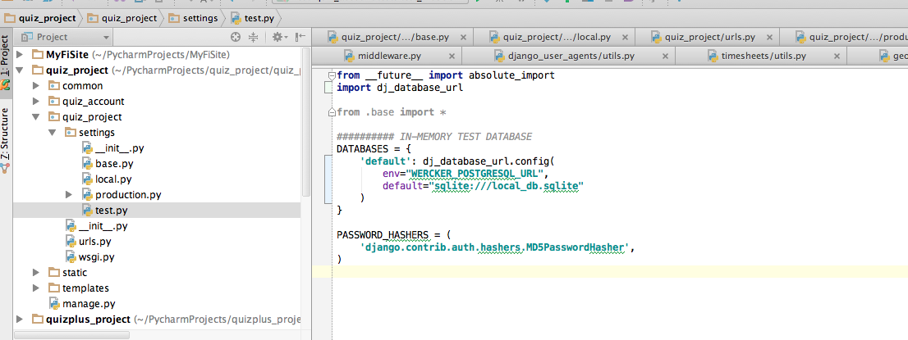
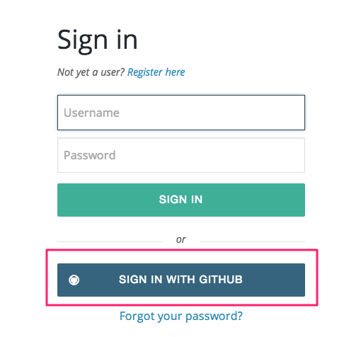
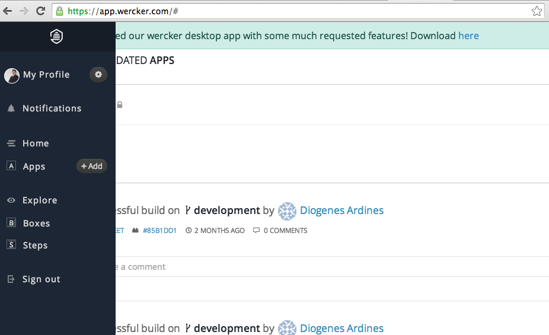
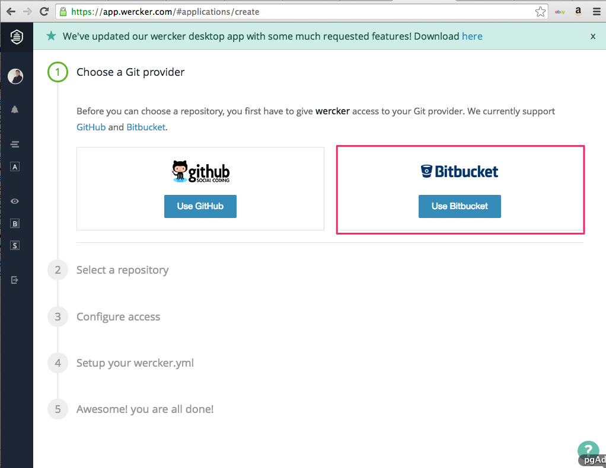
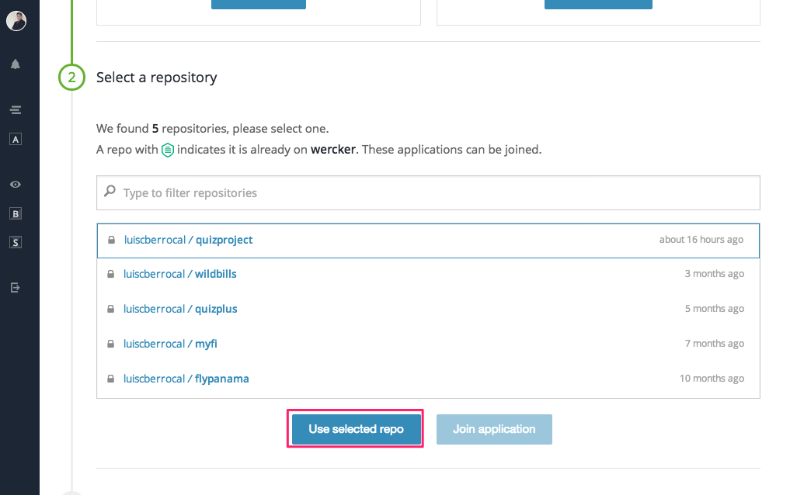
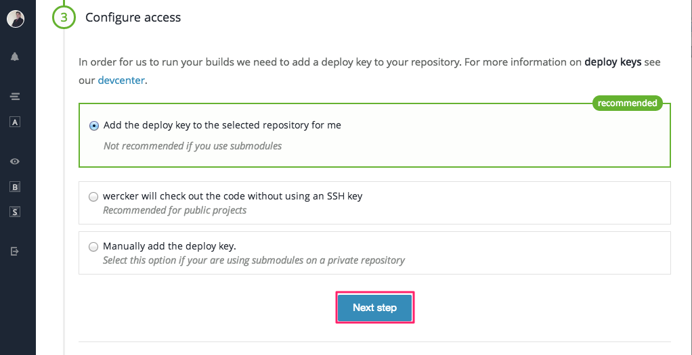
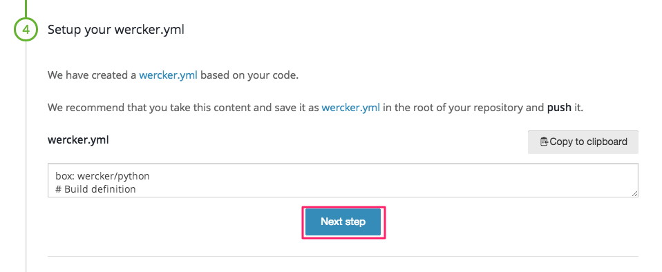

#Wercker

##Wercker.yml




##Test Settings



##Create Site on Wercker














```yml
box: wercker/python
services:
   - wercker/postgresql
# Build definition
build:
  # The steps that will be executed on build
  steps:
    # A step that sets up the python virtual environment
    #- virtualenv:
    #    name: setup virtual environment
    #    install_wheel: false # Enable wheel to speed up builds (experimental)
 
    # # Use this virtualenv step for python 3.2
    - virtualenv:
         name: setup virtual environment
         python_location: /usr/bin/python3.4
 
    # A step that executes `pip install` command.
    - pip-install
 
    # # This pip-install clears the local wheel cache
    # - pip-install:
    #     clean_wheel_dir: true
 
    # A custom script step, name value is used in the UI
    # and the code value contains the command that get executed
    - script:
        name: echo python information
        code: |
          echo "python version $(python --version) running"
          echo "pip version $(pip --version) running"
    - script: 
        name: test common app
        code: |
            python quiz_project/manage.py test common.tests -v2 --settings=quiz_project.settings.test
    - script: 
        name: test quiz_account app
        code: |
            python quiz_project/manage.py test quiz_account.tests -v2 --settings=quiz_project.settings.test
```


