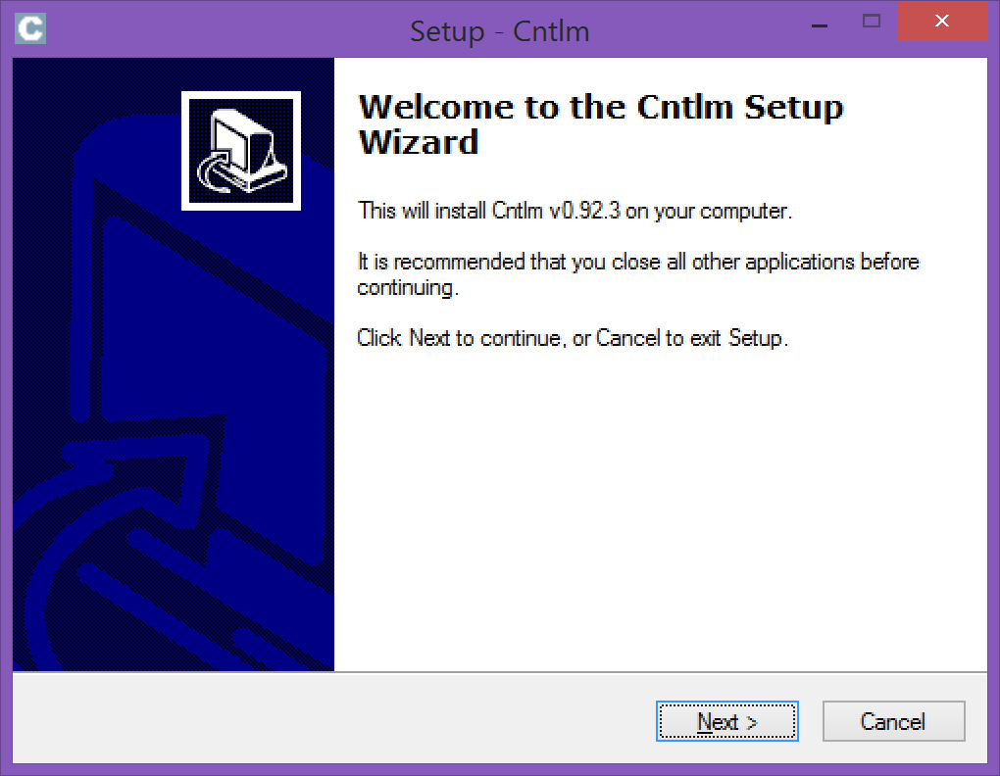
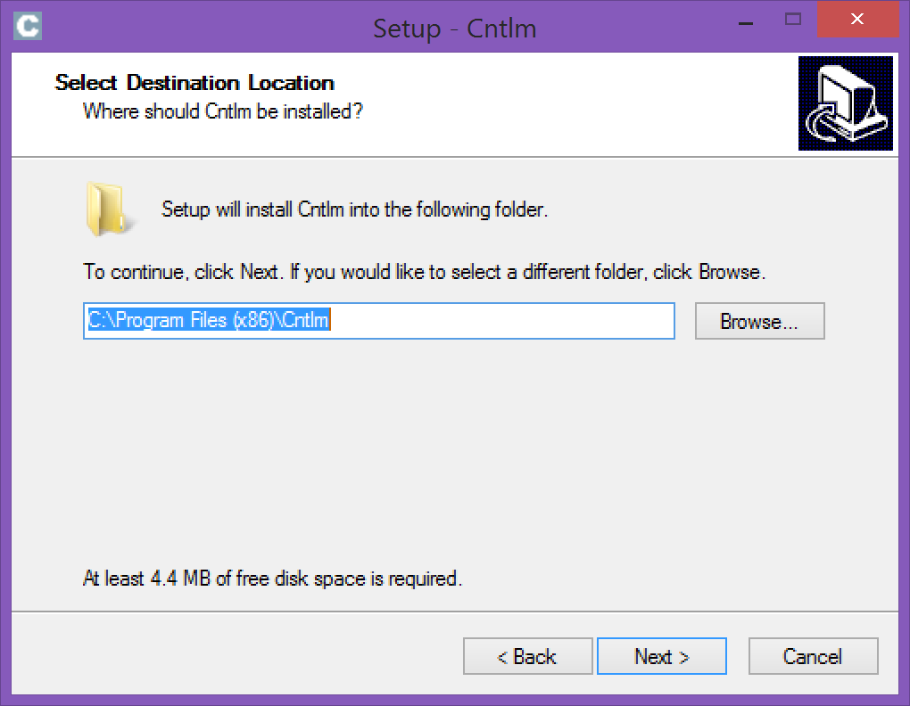
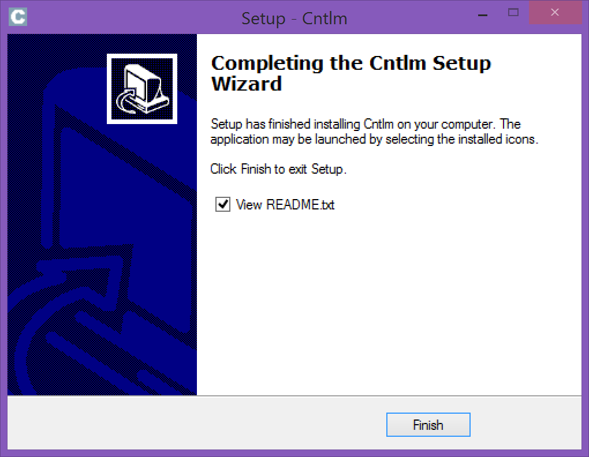
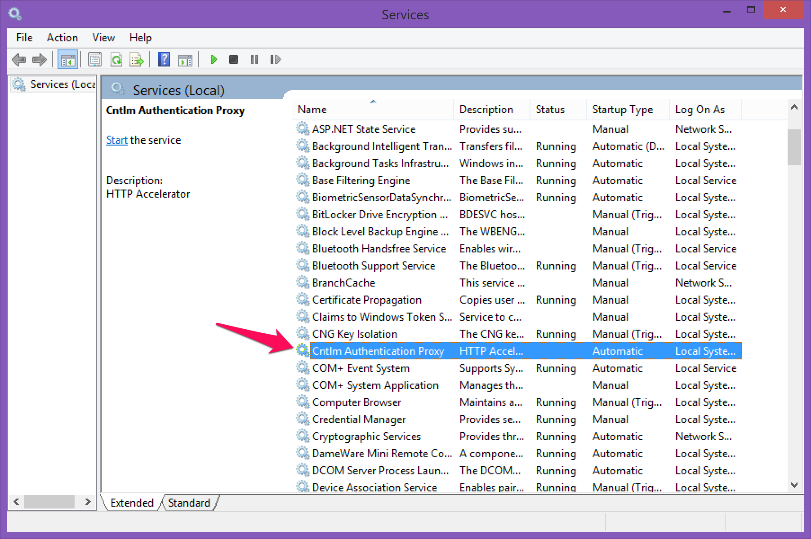
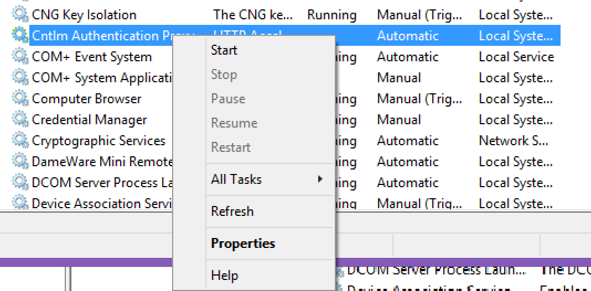

#CNTLM

 If you are behind a NTLM proxy (any Microsoft proxy) using authenticatio you will not be able to use the pip package manager.
 In orther to circunvent this you need to install the [cnltm](http://cntlm.sourceforge.net/)

## Windows

Download the latest version.


### Installing CNTLM on Windows










Open the Services window you will see a Cntlm Authentication Proxy service.



Start the service



### Configuring CNTLM on Windows

Open the file C:\Program Files (x86)\Cntlm\cntlm.ini

Find `Username` and `Domain` and replace it with your information (line 8-9). Comment password (line 10) add a hashtag at the begining of the line.

```
Username	luis.berrocal
Domain		mydomain
#Password	password
```

Save the file.

No run the hashing the command.


```
$ C:\Program Files (x86)\Cntlm\cntlm.exe -H
```


```
c:\Program Files (x86)\Cntlm>cntlm -H
      4 [main] cntlm 9364 find_fast_cwd: WARNING: Couldn't compute FAST_CWD poin
ter.  Please report this problem to
the public mailing list cygwin@cygwin.com
cygwin warning:
  MS-DOS style path detected: C:\Program Files (x86)\Cntlm\cntlm.ini
  Preferred POSIX equivalent is: /Cntlm/cntlm.ini
  CYGWIN environment variable option "nodosfilewarning" turns off this warning.
  Consult the user's guide for more details about POSIX paths:
    http://cygwin.com/cygwin-ug-net/using.html#using-pathnames
Password:
```
Type your domain password

```
PassLM          9EAB9AB5B7C08D32552C4BCA4AEBFB11
PassNT          814C53E8840DCA0F441A6F01A8F631FE
PassNTLMv2      5BAF1C59D525A8432A242D68F437D0E6    # Only for user 'luis.berrocal',
domain 'mydomain'

```


On the command window where you ran the `cntlm.exe -H` command copy the following content and paste it in the cntlm.ini (line 16-20)

```
PassLM          9EAB9AB5B7C08D32552C4BCA4AEBFB11
PassNT          814C53E8840DCA0F441A6F01A8F631FE
PassNTLMv2      5BAF1C59D525A8432A242D68F437D0E6    # Only for user 'luis.berrocal', domain 'mydomain'

```

Change the Proxy values from

```
Proxy		10.0.0.41:8080
Proxy		10.0.0.42:8080 
```

to your proxy for example

```
Proxy		thunder.mydomain.com:8080 
```

Change the listen port for cntlm from:

```
Listen		0.0.0.0:3128
```

to

```
Listen		127.0.0.1:3128
```

Save the file

Restart the cntlm service

### Configure Proxy in IE Explorer

Open IE


Use the ip address and port yuou typed in the cntlm.ini file for **Listen**


Try to acces an url on the internet.

