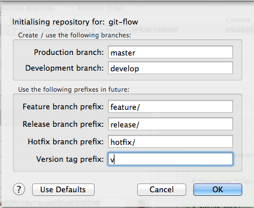
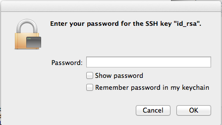
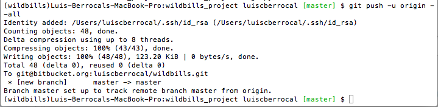
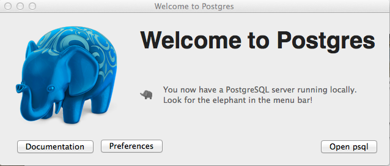

#Git

##Activate git flow

##Existing Project

Already have a Git repository on your computer? Let's push it up to Bitbucket.

´´´
$ cd /Users/luiscberrocal/PycharmProjects/wildbills_project

$ git remote add origin git@bitbucket.org:luiscberrocal/wildbills.git

$ git push -u origin --all # pushes up the repo and its refs for the first time
´´´

##Troubleshooting problems with GIT

Some times you have trouble making commits. You might need to make git more verbose in order to tell you what is wrong.

´´´

GIT_CURL_VERBOSE=1 GIT_TRACE=1 git pull origin master

´´´